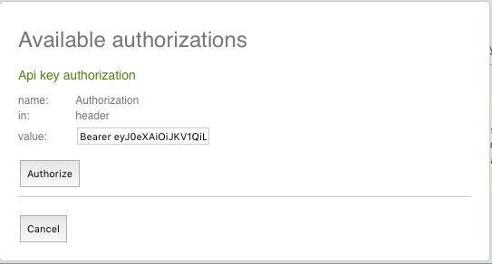

Documentation
=============

Sphinx documentation
--------------------

We are using `Sphinx <http://sphinx-doc.org/>`_ to create the (this) documentation.

The Documentation will be served under http://localhost:8007 as soon as :doc:`docker` is started.

The files for creation are under ``docs/``, the config file for Sphinx is called ``conf.py``. You can check out the `cheatsheet <http://matplotlib.org/sampledoc/cheatsheet.html>`_ for information how to format the ``.rst``-Files.

If needed, you can manually update it with::

    fab doc                # Builds the documentation once
    fab doc:autobuild      # Starts the sphinx-autobuild server

Swagger API Docs
----------------

Swagger is used to print an API documentation, accessible within http://localhost:8000/api/docs.

You need to be signed in to access all endpoints.

If you want to access protected endpoints, you need to set the Authorization token::

   How to set the Authorization header in the Swagger documentation.
